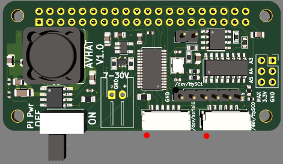

# Documentation for Pi-Connect Lite (V1)

## Introduction

The Pi-Connect Lite is a HAT addon board for the Raspberry Pi 2B/3B/4/Zero(W) that allows easy and reliable interfacing with
popular flight controllers used in unmanned vehicles.

It removes the complexity and risk of wiring up the telemetry and power connectors between the Pi and the 
vehicle systems.

It has been designed with reliability and a small form factor at the forefront, allowing for it to be used in
both the smallest and largest of vehicles.

## Features

The Pi-Connect features:
* Pi power supply
    * Wide input voltage (7 - 30V)
    * Reverse input protection
    * ESD protected
    * Supplies a full 5V at 3A for the Pi and accessories
    * Overcurrent protection
    * Short circuit protection
* 1x Telemetry (serial) port using a JST-GH 6-pin Dronecode standard connector (``/dev/serial0``)

It is 100% compliant with the Raspberry Pi HAT spec (using the uHAT size) and is
compatible with the Raspberry Pi 2, 3, 4 and Zero.

The board also features a power switch which safely switches off the Pi via issuing a shutdown
signal. This ensures the Pi is cleanly shutdown and reduces the risk of system corruption.

## Requirements

The Pi-Connect requires the following equipment:

* Power source of 7-30V, capable of supplying at least 15W
* Raspberry Pi 2B, 3B, 4, Zero, Zero W with Raspian.
* Flight controller with JST-GH telemetry connector (and cable). Examples include  
  the Cube, Pixracer and Pixhawk 4.

## Setup

### Hardware

The Pi-Connect board power leads need to be soldered to the appropriate connector for the vehicle.

Next the board should be mounted onto the Pi's 40-pin connector such that the telemetry and power
connectors face towards the interior of the Pi (as per the above picture).

The telemetry connector should be connected as required. The pinout of the JST-GH connectors allows
for direct connection to the flight controller without any crossover cables required.

### Software

Several scripts are required to load the correct drivers for the Pi-Connect.

For ease of use, ``git clone`` this repository to the Pi first and run the scripts from there.

* Install the correct dtoverlays to the Pi: [Pi-Connect-Lite-v1.sh](../SetupScripts/Pi-Connect-Lite-v1.sh)
* Reboot

## Using
###  Power switch

The power switch will perform a safe software shutdown of the Raspberry Pi before cutting power.

If an external power switch is desired, ensure the switch is connected to the Ext Switch ports on the
Pi-Connect Lite board and the Int|Ext trace is cut on the Int side and soldered on the Ext side.

The switch must be of a latching type with the centre pin common, ie:
<pic>

### UART Pinouts

The dots in the above diagram are the Pin 1 for the pinouts.

``/dev/serial0`` (unpowered, JST-GH):

Pin | Function
--- | --- 
1 | NC
2 | Pi Rx
3 | Pi Tx
4 | NC
5 | NC
6 | Ground

## Software examples

### APSync

The [APSync](http://ardupilot.org/dev/docs/apsync-intro.html) companion computer software is compatible 
with the Pi-Connect. A disk image for the Pi-Connect can be downloaded
from [here](https://drive.google.com/open?id=1f36Nkk8fJqZTni-5aqQWje96hAeIqPkg), or installed via script from [here](../Examples/APSync)

Note this assumes that the flight controller is connected to the ``dev/serial0`` port at a baud rate of 921600. Ensure
the flight controller's telemetry port is configured to output MAVLink data at that baud rate.

# Known Issues

The following issues are known with the Pi-Connect Lite v1:

* In the latest versions of Raspian (July 2019+), I2C must be disabled in order for the power
  switch to work.