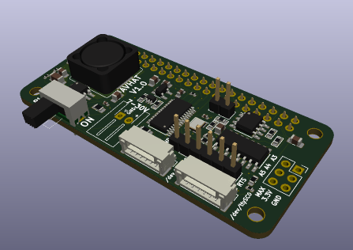
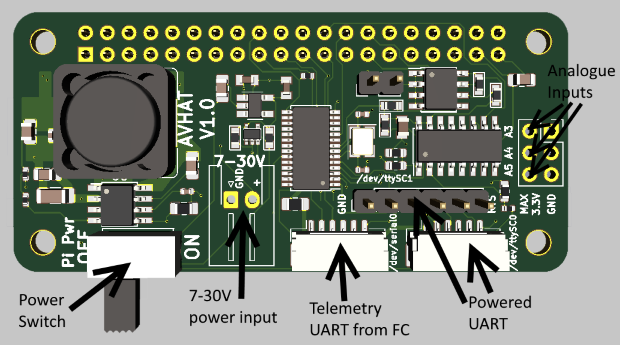

# Documentation for Pi-Connect (V1)



## Introduction

The Pi-Connect is a HAT addon board for the Raspberry Pi 2B/3B/Zero(W) that allows easy and reliable interfacing with
popular flight controllers used in unmanned vehicles.

It removes the complexity and risk of wiring up the telemetry and power connectors between the Pi and the 
vehicle systems.

It has been designed with reliability and a small form factor at the forefront, allowing for it to be used in
both the smallest and largest of vehicles.

## Features



The Pi-Connect features:
* Pi power supply
    * Wide input voltage (7 - 30V)
    * Reverse input protection
    * ESD protected
    * Supplies a full 5V at 3A for the Pi and accessories
    * Overcurrent protection
* 3x Telemetry (serial) ports
    * 2x ports use the JST-GH 6-pin Dronecode standard connector (``/dev/serial0`` and ``/dev/ttySC0``)
    * 1x port in the "FTDI" 6-pin layout (``/dev/ttySC1``)
    * 1 of the JST-GH (``/dev/ttySC0``) and the FTDI ports (``/dev/ttySC1``) are powered at 5V (0.5A max)
    * 1 of the JST-GH (``/dev/ttySC0``) and the FTDI ports (``/dev/ttySC1``) are 5V/3.3V compliant
* Analog input ports
    * 1 port for Input voltage monitoring (A0)
    * 1 port for Pi 5V rail voltage monitoring (A1)
    * 3 user ports (A3, A4, A5) for connection to analog sensors (3.3V max)

It is 100% compliant with the Raspberry Pi HAT spec (using the uHAT size) and is
compatible with the Raspberry Pi 2, 3 (NOT the 3B+) and Zero.

The board also features a power switch which safely switches off the Pi via issuing a shutdown
signal. This ensures the Pi is cleanly shutdown and reduces the risk of system corruption.

## Requirements

The Pi-Connect requires the following equipment:

* Power source of 7-30V, capable of supplying at least 15W
* Raspberry Pi 2B, 3B, Zero, Zero W with Raspian.
* Flight controller with JST-GH telemetry connector (and cable). Examples include the 
  The Cube, Pixracer, Pixhawk 4 and others.

## Setup

### Hardware


The Pi-Connect board power leads need to be soldered to the appropriate connector for the vehicle.

Next the board should be mounted onto the Pi's 40-pin connector such that the telemetry and power
connectors face towards the interior of the Pi (as per the above picture).

The telemetry connectors should be connected as required. The pinout of the JST-GH connectors allows
for direct connection to the flight controller without any crossover cables required. It is recommended to use
the ``\dev\serial0`` port for connection to the flight controller.

If using ``/dev/ttySC0`` with a flight controller, care should be taken to ensure the flight controller
is not back powered through the telemetry  port as the current draw may overload the 5V rail on the Pi-Connect. This
port is designed to be used with accessory devices (Arduino, other custom sensors) that require 5V power and a JST-GH conection.

The FTDI-style port (``/dev/ttySC1``) can be connected directly to devices such as Arduinos, noting that the port outputs
5V - so a 5V compatible device is required.

The 3 analog ports can be connected to any 3.3V analog sensor.

### Software

Several scripts are required to load the correct drivers for the Pi-Connect.

For ease of use, ``git clone`` this repository to the Pi first and run the scripts from there.

* Use the ``raspi-config`` program to disable I2C and enable SPI (under ``interfaces``)
* Install the driver for the extra UARTS: [makedts.sh](../UART/makedts.sh)
* Install the correct dtoverlays to the Pi: [Pi-Connect-v1.sh](../SetupScripts/Pi-Connect-v1.sh)
* Reboot

For the ADC (MCP3008) there are two options for functionality. First is to use the GPIO python library. The
other is to use the commandline. Note these two methods are mutually exclusive.

If you prefer the commandline for reading the analog ports:

For the commandline option add the following line to ``/boot/config.txt``:

```
dtoverlay=mcp3008,spi0-0-present=true
```

After a reboot, the analog port readings are available at ``/sys/bus/iio/devices/iio\:device0``

```
cat /sys/bus/iio/devices/iio\:device0/in_voltage0_raw
```

If using Python is preferred for reading the analog ports, first ensure the ``mcp3008`` dtoverlay mentioned
above is removed or commented out. 

Installing and using the correct Python libraries is covered in many places on the Internet for the
MCP3008. A good one is Adafruit's [guide](https://learn.adafruit.com/raspberry-pi-analog-to-digital-converters/mcp3008#source-install-2-12)

## Using
* Power switch

### UART Pinouts


The dots in the above diagram are the Pin 1 for the pinouts.

``/dev/serial0`` (unpowered, JST-GH):

Pin | Function
--- | --- 
1 | NC
2 | Pi Rx
3 | Pi Tx
4 | NC
5 | NC
6 | Ground

``/dev/ttySC0`` (powered 5V, JST-GH):

Pin | Function
--- | --- 
1 | +5V
2 | Pi Rx
3 | Pi Tx
4 | Pi RTS
5 | Pi CTS
6 | Ground

``/dev/ttySC1`` (powered 5V, 0.1" FTDI pinout):

Pin | Function
--- | --- 
1 | Ground
2 | Pi CTS
3 | +5V
4 | Pi Tx
5 | Pi Rx
6 | Pi RTS

### Analog Port Pinouts

The MCP3008 ADC used in the board has 8 inputs. Due to board size constraints, only 5 are used.

Of the 5 used, 3 are user accessible for custom sensors. These are labelled as A3, A4 and A5 on the board.
They can tolerate up to 3.3V. They also have a 100 Ohm resistor inline to limit the input current.

A0 monitors the 5V rail on the Pi. The resistor divider on the inputs give the following voltage conversion:

```
V(rail) = V(A0)*2
```

A1 monitors the Input voltage (post diode) on the Pi. The resistor divider on the inputs give the following voltage conversion:

```
V(in) = (V(A1)*(1100/100)) + 0.4
```

Note the 0.4V in the above equation is the voltage drop due to the reverse protection diode on the board.


## Software examples

### APSync

The [APSync](http://ardupilot.org/dev/docs/apsync-intro.html) companion computer software is compatible 
with the Pi-Connect. A disk image for the Pi-Connect can be downloaded
from [here](https://drive.google.com/open?id=1f36Nkk8fJqZTni-5aqQWje96hAeIqPkg), or installed via script from [here](../Examples/APSync)

Note this assumes that the flight controller is connected to the ``dev/serial0`` port at a baud rate of 921600. Ensure
the flight controller's telemetry port is configured to output MAVLink data at that baud rate.

### Analog port reading

An example Python script for using the MCP3008 ADC is available [here](../Examples/mcp.py). It requires the 
spidev package. This can be installed via the ``sudo apt install python-spidev`` or 
``sudo apt install python3-spidev``, depending on your Python version.
